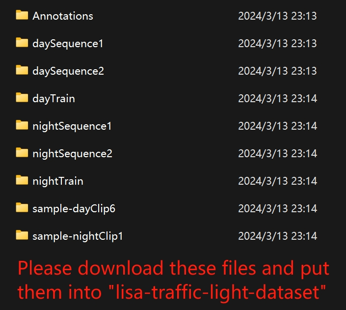

# Traffic Light Classification Using CNN and ResNet

Welcome to our traffic light classification project repository. This project employs Convolutional Neural Networks (CNN) and Residual Networks (ResNet) to classify traffic lights within a variety of images. The goal is to support the development of self-driving vehicle technology by improving the accuracy of traffic light classification.

## Project Structure

```plaintext
.
├── lisa-traffic-light-dataset/     # Dataset used for model training and testing
├── onlyClassification_PlainCNN34   # Jupyter notebook detailing the Plain CNN model training
├── onlyClassification_PlainCNN34_test # Jupyter notebook for testing the Plain CNN model
├── onlyClassification_ResNet34     # Jupyter notebook detailing the ResNet model training and evaluation
├── README.md                       # README file for the project overview and navigation
├── README.png                      # Image file of the project README
└── Project report.pdf              # Detailed project report

```

## Getting Started

### Prerequisites

- Git
- Jupyter Notebook or Jupyter Lab

### Installation

1. Clone the repository to your local machine:

```bash
git clone git@github.com:hongyuanhua/Traffic-light-classification.git
```

2. Navigate to the project directory:

```bash
cd traffic-light-classification
```

3. Explore the training process and evaluation of the models by opening the respective Jupyter notebooks:

For the ResNet model:

```bash
jupyter notebook onlyClassification_ResNet34.ipynb
```

For the Plain CNN model:

```bash
jupyter notebook onlyClassification_PlainCNN34.ipynb
```

## Dataset
The project uses the LISA Traffic Light Dataset, which provides various traffic scenes essential for developing a robust traffic light classification system.

## Models
*   `onlyClassification_PlainCNN34` - Jupyter notebook with the training process of the CNN model.
*   `onlyClassification_PlainCNN34_test` - Jupyter notebook for testing the CNN model.
*   `onlyClassification_ResNet34` - Jupyter notebook for the ResNet model's training and evaluation.

## Results
The ResNet model achieved a classification accuracy of 98.95%, surpassing the CNN model, which achieved 97.59% accuracy. This demonstrates the superior performance of ResNet for the task of traffic light classification.